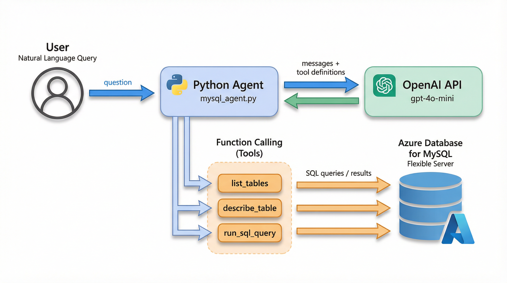

# 🤖 MySQL AI Agent

**An AI-powered agent that lets you query Azure Database for MySQL using natural language.**

Built with Python, OpenAI Function Calling, and Azure Database for MySQL Flexible Server.



## How It Works

1. You type a question in plain English (e.g., *"What is the total revenue by city?"*)
2. The agent sends your question to OpenAI's GPT model
3. GPT decides which **tools** to call (list tables, describe schema, or run SQL)
4. The agent executes the tool against your Azure MySQL database
5. Results are sent back to GPT, which formats a human-readable answer
6. If the SQL query fails, the agent **self-corrects** and retries automatically

## Tools

| Tool | Description |
|------|-------------|
| `list_tables` | Lists all tables in the database |
| `describe_table` | Gets column names, types, and keys for a table |
| `run_sql_query` | Executes a read-only SELECT query and returns results |

## Prerequisites

- **Python 3.10+** — [Download](https://www.python.org/downloads/)
- **Azure account** — [Free signup](https://azure.microsoft.com/free) (12 months free MySQL)
- **OpenAI API key** — [Get one](https://platform.openai.com/api-keys)

## Quick Start

### 1. Clone the repo

```bash
git clone https://github.com/FarahAbdo/mysql-ai-agent.git
cd mysql-ai-agent
```

### 2. Create virtual environment

```bash
python -m venv venv

# Windows
venv\Scripts\activate

# macOS/Linux
source venv/bin/activate
```

### 3. Install dependencies

```bash
pip install -r requirements.txt
```

### 4. Set up environment variables

Create a `.env` file in the project root:

```env
OPENAI_API_KEY=sk-proj-xxxxxxxxxxxxxxxxxxxxxxxx
MYSQL_HOST=your-server.mysql.database.azure.com
MYSQL_USER=mysqladmin
MYSQL_PASSWORD=YourPasswordHere
MYSQL_DATABASE=demo_sales
```

### 5. Set up the database

Connect to your Azure MySQL server and run the SQL in `setup_database.sql` to create the sample data.

### 6. Run the agent

```bash
python mysql_agent.py
```

## Example Conversation

```
🧑 You: What tables are in this database?
  🔧 Calling tool: list_tables({})
🤖 Agent: The database contains 2 tables: customers and orders.

🧑 You: What is the total revenue by city?
  🔧 Calling tool: run_sql_query({"query": "SELECT c.city, SUM(o.amount)..."})
🤖 Agent:
| City   | Total Revenue |
|--------|---------------|
| Mumbai | $200.00       |
| Cairo  | $195.00       |
| London | $99.00        |
```

## Security Features

- ✅ **SELECT-only enforcement** — rejects INSERT, UPDATE, DELETE, DROP
- ✅ **SQL error self-correction** — catches MySQL errors and lets GPT retry
- ✅ **SSL encryption** — all database connections are encrypted
- ✅ **Environment variables** — no hardcoded credentials

## Cost

| Component | Cost |
|-----------|------|
| Azure MySQL (B1ms) | Free for 12 months |
| OpenAI API (gpt-4o-mini) | ~$0.01 for the entire demo |
| Python packages | Free |

## Tech Stack

- **Python 3.11+**
- **OpenAI API** (gpt-4o-mini with function calling)
- **Azure Database for MySQL** Flexible Server
- **mysql-connector-python** for database connectivity

## Blog Post

📖 Read the full tutorial on [Microsoft Tech Community](https://techcommunity.microsoft.com/) *(link to be added after publishing)*

## License

MIT License — feel free to use, modify, and share.
